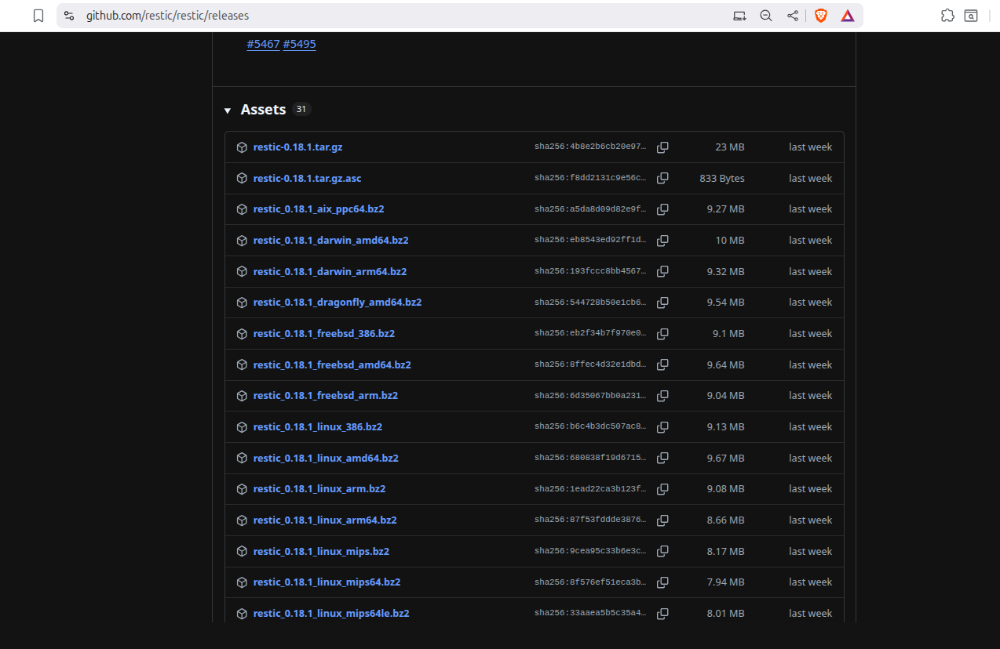
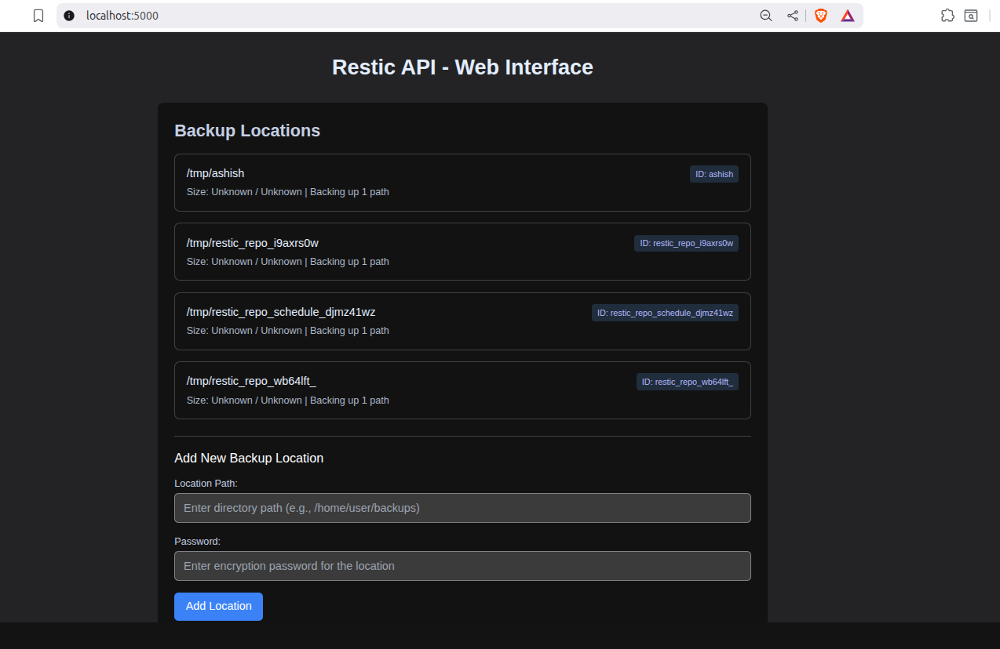
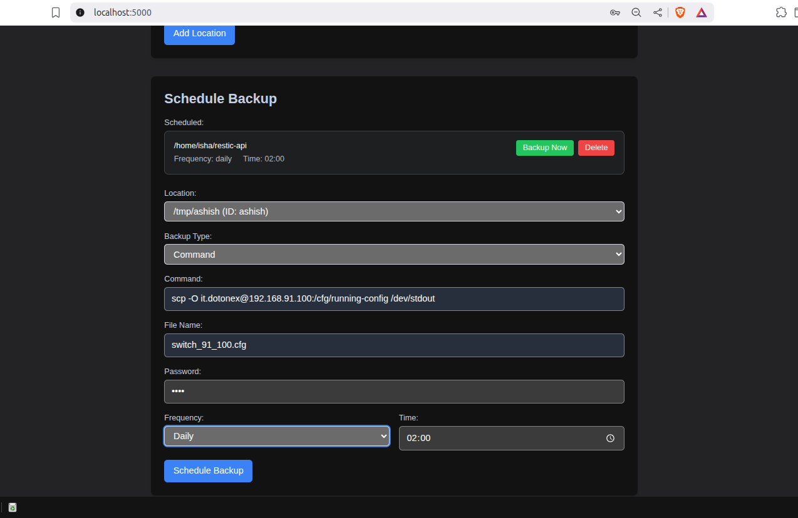

# Aruba switches config backup

The steps here can backup pretty much any switch config but since I had to work with Aruba switches, the exact steps are presented for it. But if you look to backup config of switches, network device or any other device which allows for picking the config from it through `scp` or any other command, this setup is going to work for you. 

We use [restic-api](https://github.com/pocha/restic-api), a web based backup tool that uses [restic](https://github.com/restic/restic) binary to do the backup.

# Setup/Installation steps

You need to choose a computer where `restic-api` will be installed & setup, it will be doing daily backup of the switches. You can choose any computer but the steps are tested to work on an Ubuntu computer. 


## 1. Install restic binary

Navigate to [https://github.com/restic/restic/releases](https://github.com/restic/restic/releases). Scroll down to the list of installable files under **Assets** title. Download & install the one relevant for your machine. 



For Ubuntu, running on Intel based machines, the right one will be `restic_0.18.1_freebsd_amd64.bz2`. Download & unzip it using bunzip2

```
bunzip2 restic_0.18.1_freebsd_amd64.bz2
```

Move the generated binary to /usr/local/bin directory

```
sudo mv restic_0.18.1 /usr/local/bin
```

Run `restic version` to check if restic is installed & it should show the version

## 2. Install Restic API 

Install git if not installed 

```
sudo apt install git
```

Git clone [restic-api](https://github.com/pocha/restic-api) & run the installer inside the `install` directory

```
git clone https://github.com/pocha/restic-api
cd restic-api/install
sudo ./install-linux.sh 
```

Navigate to `http://localhost:5000` to see the User Interface on the web. 


## 3. Switch configuration changes

We need to ensure that machine running `restic-api` can `scp` the config from the switches to itself & then back it up. Below are the steps to ensure the same. 

Enable filetransfer on ssh by adding the below line in the configuration 

```
ip ssh filetransfer
```

**Public-key based access without password**

If you do NOT use RADIUS/tacacs authentication & have local users built into the switch, enable ssh authentication to use public-key & add the public-key of the machine on which restic-api & restic binaries are installed. 


```
aaa authentication ssh login public-key
ip ssh public-key manager 'ssh-rsa xxxxxxxxxxxxxxxxxxxxxxxxxxxxxxxxxxxxxxxxxxxxxxxxxxxxxxxx' username <username> 
```

Replace `<username>` with the user created for the switch. The user is assumed to have manager level access so that it can access the configuration. 

The content within 'ssh-rsa xxxx' is the `~/.ssh/id_rsa.pub` file content that is generated from `ssh-keygen` command. Aruba switch only takes rsa public key. The default key generation might not be rsa. Generate rsa key with 

```
ssh-keygen -t rsa
```

command on the backup machine. You can leave the password prompt empty (press enter without any inputs|).

To test if this is working fine, run the following command 

```
scp -O <username>@<switch-ip>:/cfg/running-config /dev/stdout
```
You should see the config dumped on the stdout & there should NOT be any password prompt. 


**RADIUS/tacacs setup steps**

If you are running RADIUS/tacacs server, create a user for file backup process with manager level access in RADIUS/tacacs server.

Install `sshpass` on the backup ubuntu machine

```
sudo apt install sshpass
```

Add the password of the user created in RADIUS server in a file at a convenient location (home of the linux user on ubuntu machine).

```
echo "<password>" > ~/password
chmod 400 ~/password
```

Now run the command to get the configuration

```
sshpass -f ~/password scp -O <username>@<switch-ip>:/cfg/running-config /dev/stdout
```

You should see the config dump on the terminal window. 

## 3. Scheduling backup with Restic API 

- Add a backup location, maybe, a directory on the backup machine, where backup of the configs will be stored. You need to provide password for the location & the same password is required while scheduling & restoring backup. So remember the backup location password is important :). 



- Under `Schedule Backup`, choose `Command`. Specify command as the same that we tested before - `scp -O <switch-user>@<switch-ip>:/cfg/running-config /dev/stdout`. In `Filename`, specify a unique name to identify the backup file. 



- Once backup is scheduled, click on 'Backup Now' button next to the scheduled backup to check if backup works.
 
- Once a backup is taken, go to `Restore` section, choose the appropriate backup location & restore directory option, click on Restore. It should list at least one backup snapshot. You can restore the backup in `/tmp` location & it should create `/tmp/<filename>` which you can compare with the config of the switch.

 
